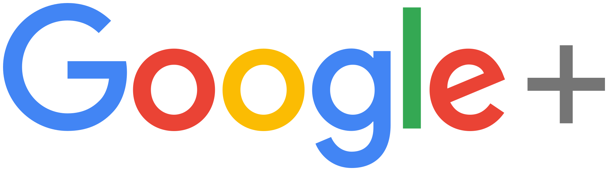

## Google+ macht dicht. Aber es gibt Alternativen
Vor wenigen Tagen hat google angekündigt die Social Media Plattform google+ für den privaten Anwender zu schließen 
und nur noch als Enterprice Anwendung weiterzubetreieben. Nötig wurde dieser Schritt, weil es zu Problemen im Zugriff 
von APPS kam. Ob das nur ein Vorgeschobener Grund ist oder ob das Vorhaben aus Erfolglosigkeit (Sicht Google) fallen 
gelassen wurde kann man so oder so sehen. 

Natürlich eine riesen Katastrophe. Immerhin hat man einige Zeit investiert, um sich oder seine Community richtig in Schale zu bringen.Da ist also nicht nur der verlorene Inhalt, sondern auch die umfangreiche Suche nach einer Alternative, wenn die überhaupt zu finden ist.
